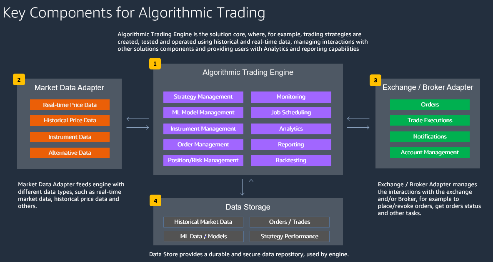

# Automated Trading Systems

### Definition of a Trading System
A trading system is a set of rules that formulate buy and sell signals without any ambiguity or any subjective elements. These signals are mostly generated by technical indicators or combinations of technical indicators. The primary aim of a trading system is to manage risk and to increase profitability in any market environment. Optimal levels of risk and reward are accomplished by modifying the different parameters within each rule of the system.

A benefit of trading with a system is the removal of emotion from trading: systematical trader will, for instance, not place an excessively high risk trade due to frustration from a prior losing trade. But there are many other benefits to extract from a methodological approach as you will see later.

No system is better than another, but a good system is one that is adapted to your goals, your time window, your start capital and also to your personality.
